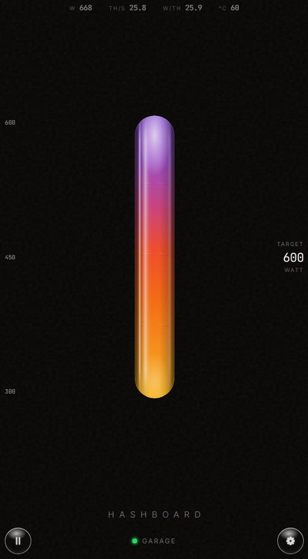
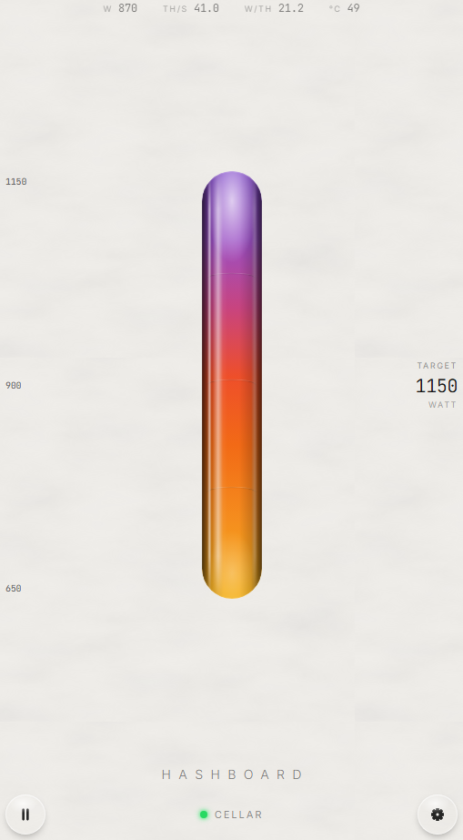

# Hashboard

> A dead-simple UI for running a Bitcoin ASIC miner as a space heater — built so anyone in the house can use it.

<p align="center">
  
  &nbsp;&nbsp;
  
</p>

Hashboard turns an ASIC miner into an ordinary appliance: open it on your phone, see how much heat it's making, and slide it up or down. No mining knowledge required. It's made for the people you share a home with — your partner, your kids, a friend — not for the person who set the miner up.

It installs in one tap on **StartOS (Start9)**, with **Umbrel** and **Home Assistant** on the way.

## Features

- 🔥 **One slider** — set the miner's power (and therefore its heat) anywhere from off up to its configured maximum.
- 🔒 **Safe by design** — the maximum is captured from the miner's own power target on first connect and locked. Nobody can push it higher than how it was set up; changing the ceiling means removing and re-adding the miner.
- ⏯️ **Pause / resume** from your pocket.
- 📊 **Live readout** — hashrate, power draw, chip temperature and fan speed, refreshed every few seconds.
- 🔎 **LAN scan** — finds miners on your network automatically.
- 🤍 **Pearl & dark themes**, mobile-first.
- 🧩 **Multi-firmware** through the open [asic-rs](https://github.com/256foundation/asic-rs) library.

## Supported miners

Hashboard speaks to miners through the open **asic-rs** library from the [256 Foundation](https://github.com/256foundation/asic-rs). Monitoring works across **Antminer (stock), Whatsminer, Avalon, BraiinsOS+, LuxOS, Vnish, ePIC, Marathon, Bitaxe** and more. Power-target control is available wherever the firmware exposes it.

## Install

### StartOS (Start9) — recommended
Download the latest `hashboard.s9pk` from [**Releases**](https://github.com/heatpunk/hashboard/releases/latest) and sideload it: in StartOS, go to **System → Sideload** and pick the file.

### Docker
```bash
docker run -d --network host --name hashboard ghcr.io/heatpunk/hashboard:latest
```
`--network host` lets the container reach miners on your LAN. The UI is served on port 80.

### Umbrel
Add our community app store in your Umbrel — **App Store → ⋯ → Community App Stores** — with this URL:

```
https://github.com/heatpunk/umbrel-app-store
```

Then install **Hashboard** from the store. Details and official-store submission notes live in [`umbrel/README.md`](umbrel/README.md).

### Home Assistant
On Home Assistant OS/Supervised, add this repo as an add-on repository — **Settings → Add-ons → Add-on Store → ⋯ → Repositories**:

```
https://github.com/heatpunk/hashboard
```

Then install the **Hashboard** add-on. Container-based installs can use the HACS integration instead — see [`hashboard-addon/DOCS.md`](hashboard-addon/DOCS.md).

## How it works

```
 Phone / tablet (same Wi-Fi)
          │
          ▼
 serve.cjs  :80     Node — serves the built UI and reverse-proxies /api/*
          │
          ▼
 proxy-rs   :8081   Rust — uses asic-rs to talk to the miner
          │
          ▼
 Miner              each firmware's native API (BraiinsOS, LuxOS, stock, …)
```

- **UI** — React/Vite, built to static assets.
- **`serve.cjs`** — tiny Node server that serves the UI and forwards every `/api/*` call to `proxy-rs`.
- **`proxy-rs`** — Rust service that does all miner communication via [asic-rs](https://github.com/256foundation/asic-rs); replaces the original Node/CGMiner proxy.

More detail in [proxy-rs/MAPPING.md](proxy-rs/MAPPING.md).

## API

`proxy-rs` exposes a small JSON API on `127.0.0.1:8081`:

| Endpoint | Description |
|----------|-------------|
| `GET /api/health` | Health check |
| `GET /api/miners/{ip}/stats` | Live data (hashrate, watts, temp, fans, power target) |
| `POST /api/miners/{ip}/power` | Set the whole-machine power target |
| `POST /api/miners/{ip}/pause` | Pause mining |
| `POST /api/miners/{ip}/resume` | Resume mining |
| `GET /api/scan?subnet=192.168.1` | Scan a `/24` subnet for miners |
| `GET /api/miners/{ip}/rawdata` | Raw asic-rs data (debug) |

## Development

```bash
npm install
npm run dev:full     # starts the Rust proxy (cargo) and Vite together
```

Open the Vite URL (port `8080`) from a phone on the same network. See [CONTRIBUTING.md](CONTRIBUTING.md) for prerequisites, tests and project layout.

## Built on

- [**asic-rs**](https://github.com/256foundation/asic-rs) — the 256 Foundation's open miner-management library, which gives Hashboard its multi-firmware support.
- [**StartOS**](https://github.com/Start9Labs/start-os) — the sovereign-server OS Hashboard packages for.

## License

[MIT](LICENSE) © heatpunk
